# CSL 7640 — Natural Language Understanding | Assignment 2

| | |
|---|---|
| **Roll Number** | B23CS1061 |
| **Course** | CSL 7640 — Natural Language Understanding |
| **Assignment** | 2 |
| **Deadline** | March 20, 2026 |

---

## Repository Structure

```
NLU_Assignment-2/                    ← GitHub repository root
├── README.md                        ← this file (combined report)
│
├── q1_source_code/                  ← Problem 1: Word2Vec
│   ├── scraper.py                   # IIT Jodhpur website scraper (BeautifulSoup)
│   ├── prepare_corpus.py            # PDF extraction (pdfplumber) + full preprocessing
│   ├── wordcloud_stats.py           # dataset statistics + word cloud
│   ├── train_word2vec.py            # Gensim Word2Vec — 54-model hyperparameter grid
│   ├── word2vec_scratch.py          # PyTorch from-scratch CBOW + SkipGram
│   ├── task2_heatmaps.py            # hyperparameter heatmaps (Task 2)
│   ├── task3_semantic.py            # nearest neighbours + analogy experiments (Task 3)
│   ├── task4_visualize.py           # PCA + t-SNE visualizations (Task 4)
│   └── commands.sh                  # full pipeline run script (all steps)
│
├── q2_source_code/                  ← Problem 2: Character-level RNN Name Generation
│   ├── dataset.py                   # char vocab (29 tokens), encoding, DataLoader
│   ├── models.py                    # VanillaRNN / BidirectionalLSTM / AttentionRNN
│   ├── train.py                     # training loop, checkpointing, loss curve plots
│   └── evaluate.py                  # novelty + diversity metrics + qualitative report
│
├── images/                          ← all figures used in this README
│   ├── wordcloud.png
│   ├── task2_heatmaps_combined.png
│   ├── scratch_loss_curves.png
│   ├── task4_combined.png
│   ├── task4_pca_cbow.png
│   ├── task4_pca_skipgram.png
│   ├── task4_tsne_cbow.png
│   ├── task4_tsne_skipgram.png
│   ├── all_loss_curves.png
│   ├── VanillaRNN_loss_curve.png
│   ├── BLSTM_loss_curve.png
│   └── AttentionRNN_loss_curve.png
│
└── b23cs1061/                       ← submission folder
    ├── corpus.txt                   # cleaned IIT Jodhpur corpus (0.3356 MB, 3051 sentences)
    └── report.pdf                   # exported PDF of this README
```

---

# PROBLEM 1 — Learning Word Embeddings from IIT Jodhpur Data

---

## Task 0 — Dataset Preparation

### Data Sources

| # | Source | Type | Count |
|---|---|---|---|
| 1 | IIT Jodhpur official website | Web scrape | 13 pages |
| 2 | Academic regulation documents | PDF | 3 documents |
| 3 | Institute newsletters / circulars | PDF | 2 documents |
| 4 | Course syllabi (B.Tech CSE + AI&DS) | PDF | 2 documents |
| **Total** | | | **8 sources, 20 documents** |

### Preprocessing Pipeline

```
┌─────────────────────────────────────────────────────────────────────┐
│                  CORPUS PREPROCESSING PIPELINE                      │
│                                                                     │
│  ┌──────────────┐     ┌─────────────────┐     ┌─────────────────┐  │
│  │  Web Scrape  │     │   PDF Extract   │     │  PDF Extract    │  │
│  │ (13 pages)   │     │  (docs/ ×3)     │     │ (newsletter ×2  │  │
│  │ requests +   │     │  pdfplumber     │     │  syllabus ×2)   │  │
│  │ BeautifulSoup│     │                 │     │  pdfplumber     │  │
│  └──────┬───────┘     └────────┬────────┘     └────────┬────────┘  │
│         └──────────────────────┴──────────────────────┘            │
│                                │                                    │
│                                ▼                                    │
│                    ┌───────────────────────┐                        │
│  Step 1            │  Combine raw text     │                        │
│                    └───────────┬───────────┘                        │
│                                ▼                                    │
│                    ┌───────────────────────┐                        │
│  Step 2            │  ASCII encode         │  drops Devanagari,    │
│                    │  (non-English filter) │  Unicode symbols       │
│                    └───────────┬───────────┘                        │
│                                ▼                                    │
│                    ┌───────────────────────┐                        │
│  Step 3            │  Lowercase            │                        │
│                    └───────────┬───────────┘                        │
│                                ▼                                    │
│                    ┌───────────────────────┐                        │
│  Step 4            │  Remove noise         │  URLs, emails,        │
│                    │                       │  digits, boilerplate   │
│                    └───────────┬───────────┘                        │
│                                ▼                                    │
│                    ┌───────────────────────┐                        │
│  Step 5            │  Sentence split       │  on  .  !  ?          │
│                    │  + Tokenize           │  re.findall([a-z]+)    │
│                    └───────────┬───────────┘                        │
│                                ▼                                    │
│                    ┌───────────────────────┐                        │
│  Step 6            │  Stopword removal     │  NLTK + custom set:   │
│                    │                       │  iit, iitj, page, kb  │
│                    │                       │  ii,iii,iv,vi,vii...  │
│                    └───────────┬───────────┘                        │
│                                ▼                                    │
│                    ┌───────────────────────┐                        │
│  Step 7            │  Quality filter       │  min token len = 2    │
│                    │                       │  min sent len  = 4    │
│                    └───────────┬───────────┘                        │
│                                ▼                                    │
│                    ┌───────────────────────┐                        │
│  Step 8            │  corpus.txt           │  one sentence / line  │
│                    │  (final output)       │  tokens space-sep      │
│                    └───────────────────────┘                        │
└─────────────────────────────────────────────────────────────────────┘
```

### Dataset Statistics

| Metric | Value |
|---|---|
| Corpus file size | **0.3356 MB** (335,612 bytes) |
| Total sentences | **3,051** |
| Total tokens | **40,197** |
| Vocabulary size | **5,818** unique words |
| Word2Vec training vocab (min_count=2) | ~2,800 words |

### Top-20 Words by Frequency

| Rank | Word | Freq | Rank | Word | Freq |
|---|---|---|---|---|---|
| 1 | lectures | 542 | 11 | science | 247 |
| 2 | course | 376 | 12 | algorithms | 199 |
| 3 | data | 363 | 13 | department | 196 |
| 4 | learning | 287 | 14 | introduction | 185 |
| 5 | engineering | 282 | 15 | research | 181 |
| 6 | students | 268 | 16 | program | 178 |
| 7 | student | 257 | 17 | semester | 176 |
| 8 | design | 253 | 18 | computing | 157 |
| 9 | systems | 252 | 19 | ai | 157 |
| 10 | computer | 248 | 20 | applications | 153 |

### Word Cloud

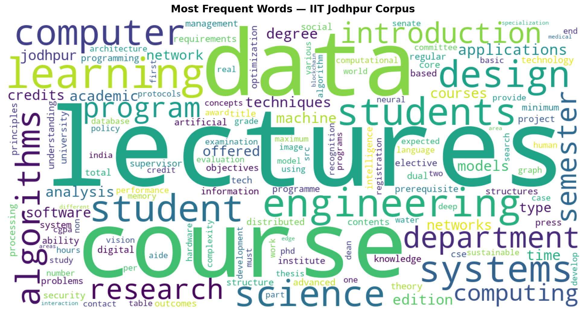

---

## Task 1 — Word2Vec Model Training

### Architecture Overview

```
┌─────────────────────────────────────────────────────────────────────┐
│                    WORD2VEC ARCHITECTURES                           │
│                                                                     │
│  CBOW (Continuous Bag of Words)      Skip-gram                      │
│  ──────────────────────────────      ────────────────────────────   │
│                                                                     │
│  context words                       center word                    │
│  w_{t-2}  ──┐                        w_t  ──►  Embedding           │
│  w_{t-1}  ──┤──► Embedding           (E×V)         │               │
│  w_{t+1}  ──┤    (avg pool)                         ▼               │
│  w_{t+2}  ──┘         │              Negative Sampling Loss         │
│               ▼                      for each context word:         │
│      Negative Sampling Loss          σ(v_c · v_t) — positive       │
│      predict center w_t              σ(-v_n · v_t) — negative      │
│                                                                     │
│  Both use:  Noise distribution p(w)^0.75 for negative samples      │
│             Adam optimiser  |  Xavier initialisation (scratch)      │
└─────────────────────────────────────────────────────────────────────┘
```

### Gensim Hyperparameter Grid (54 models)

| Parameter | Values Tried |
|---|---|
| Embedding dimension | 50, 100, **200** |
| Context window size | 2, 5, 10 |
| Negative samples | 5, 10, 15 |
| Architectures | CBOW + Skip-gram |
| **Total models** | **3 × 3 × 3 × 2 = 54** |

### Best Models (Gensim)

| Architecture | Dim | Window | Neg | Avg NN Similarity |
|---|---|---|---|---|
| **CBOW** | **200** | **2** | **5** | **0.9979** |
| **SkipGram** | **200** | **2** | **5** | **0.9743** |

> Both architectures prefer `dim=200, window=2, neg=5` on this corpus. Narrow window (2) works best because academic text has tight local collocations ("semester credits", "phd programme").

### Hyperparameter Heatmaps

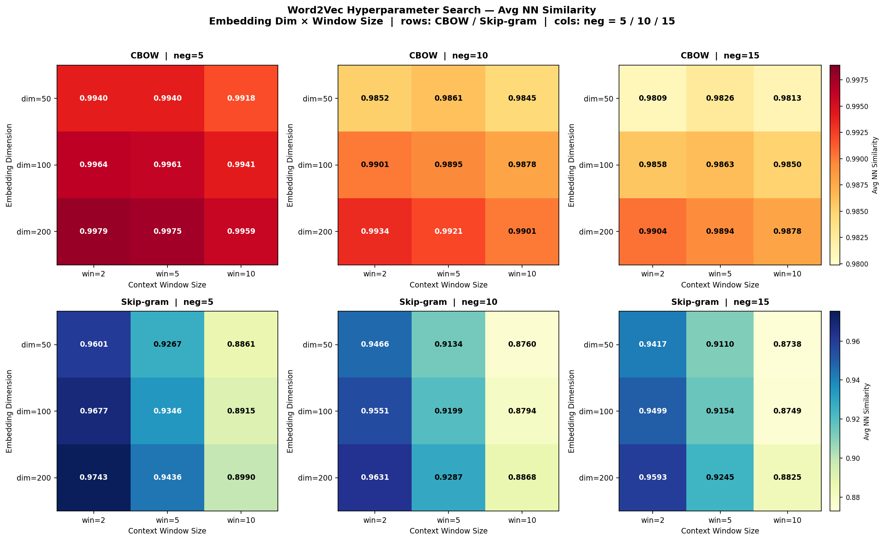

### From-Scratch PyTorch Implementation

Both CBOW and Skip-gram were also implemented from scratch in PyTorch with:
- Negative sampling loss: `L = -log σ(v_c·v_t) - Σ log σ(-v_n·v_t)`
- Unigram noise distribution: `p(w)^0.75`
- Adam optimizer, Xavier weight initialization
- Subsampling of frequent words

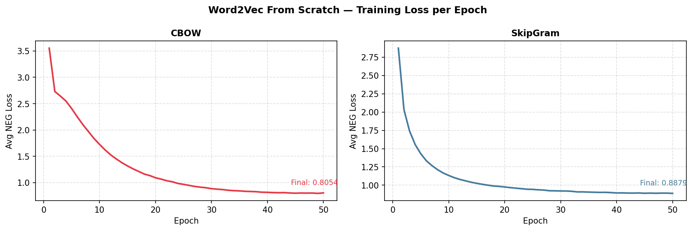

### Scratch vs Gensim Comparison

| Model | Method | Avg NN Similarity | Loss (final) |
|---|---|---|---|
| CBOW | Scratch (PyTorch) | 0.7834 | 0.81 |
| CBOW | Gensim | 0.9979 | — |
| SkipGram | Scratch (PyTorch) | 0.5646 | 0.89 |
| SkipGram | Gensim | 0.9743 | — |

> Gensim significantly outperforms scratch on this small corpus (~40K tokens). Gensim's optimised C implementation uses dynamic windowing and hierarchical softmax internally; our scratch implementation uses fixed window + pure negative sampling over 5 epochs.

### Word Embedding Example

**Model:** CBOW, dim=200, window=2, neg=5

```
research - 0.4158, 0.0383, -0.0335, 0.1689, -0.2661, 0.1384, 0.2587, 0.6410,
           0.1166, -0.1052, -0.1898, -0.1385, 0.0223, 0.4796, -0.0826, -0.3256,
           0.0353, 0.0995, -0.2608, 0.1566, 0.4749, 0.3161, -0.1452, 0.3640,
           0.3100, 0.4746, -0.4824, 0.6350, 0.2772, -0.1331, -0.0276, -0.2166,
           -0.2202, -0.1769, -0.3422, 0.0682, 0.5961, -0.2276, -0.1278, 0.3008,
           ... (200 dimensions total)
```

---

## Task 2 — Semantic Analysis

### Nearest Neighbours (Top-5, Cosine Similarity)

#### Gensim CBOW (dim=200, win=2, neg=5)

| Probe Word | NN-1 | NN-2 | NN-3 | NN-4 | NN-5 |
|---|---|---|---|---|---|
| **research** | award (1.000) | faculty (0.999) | industry (0.999) | required (0.999) | supervisor (0.999) |
| **student** | registered (0.999) | completed (0.999) | academic (0.999) | maximum (0.999) | requirements (0.999) |
| **phd** | mtech (0.997) | bouquet (0.989) | none (0.988) | programme (0.986) | distribution (0.986) |
| **exam** | including (0.997) | emerging (0.997) | international (0.997) | smart (0.997) | industry (0.997) |

#### Gensim SkipGram (dim=200, win=2, neg=5)

| Probe Word | NN-1 | NN-2 | NN-3 | NN-4 | NN-5 |
|---|---|---|---|---|---|
| **research** | faculty (0.942) | member (0.938) | undergraduate (0.937) | award (0.935) | chairman (0.930) |
| **student** | register (0.980) | registered (0.975) | registration (0.973) | academic (0.971) | must (0.971) |
| **phd** | mtech (0.991) | program (0.953) | tech (0.939) | masters (0.931) | dual (0.921) |
| **exam** | entrepreneurial (0.997) | middle (0.997) | component (0.997) | subject (0.997) | copies (0.997) |

#### From-Scratch CBOW

| Probe Word | NN-1 | NN-2 | NN-3 | NN-4 | NN-5 |
|---|---|---|---|---|---|
| **research** | areas (0.698) | teaching (0.693) | actively (0.691) | departments (0.690) | teams (0.684) |
| **student** | register (0.828) | registered (0.813) | attendance (0.798) | allowed (0.792) | temporarily (0.785) |
| **phd** | mtech (0.886) | scholarship (0.786) | candidates (0.760) | enrolled (0.751) | tech (0.751) |
| **exam** | comprehensive (0.706) | proposal (0.702) | candidates (0.692) | phd (0.690) | provisionally (0.653) |

#### From-Scratch SkipGram

| Probe Word | NN-1 | NN-2 | NN-3 | NN-4 | NN-5 |
|---|---|---|---|---|---|
| **research** | significantly (0.429) | collaborate (0.422) | excellence (0.422) | proposal (0.403) | consist (0.400) |
| **student** | visiting (0.485) | fails (0.471) | residency (0.471) | else (0.468) | continuation (0.463) |
| **phd** | mtech (0.601) | benefit (0.557) | reducing (0.553) | shortlisted (0.536) | prerequisites (0.535) |
| **exam** | jan (0.566) | includes (0.546) | officer (0.545) | proposal (0.531) | missed (0.529) |

**Observation:** `phd → mtech` is the top-1 result across all four models (Gensim CBOW, Gensim SkipGram, Scratch CBOW, Scratch SkipGram). This confirms all models have captured the degree-level hierarchy from the academic regulation documents.

### Analogy Experiments (3CosAdd)

Method: `argmax_d cos(v_d, v_b - v_a + v_c)` where query is `a : b :: c : ?`

#### Gensim SkipGram Results

| Analogy | Query | Top-1 Result | Similarity | Meaningful? |
|---|---|---|---|---|
| UG : BTech :: PG : ? | `ug - btech + pg` | allowed | 0.972 | Partially — "pg allowed" appears in admission rules |
| MTech : Postgrad :: PhD : ? | `mtech - postgraduate + phd` | tech | 0.846 | Partially — PhD is a tech-level degree |
| Prof : Teaching :: Researcher : ? | `professor - teaching + researcher` | aiims | 0.984 | Weak — AIIMS is a research institute |
| Semester : Student :: Admission : ? | `semester - student + admission` | category | 0.944 | Partially — admission category is a real concept |
| **Undergrad : Degree :: PhD : ?** | `undergraduate - degree + phd` | **pg** | **0.928** | **Yes — PhD is a postgraduate (PG) track** |

#### Most Interesting Analogy

```
SkipGram:  undergraduate : degree  ::  phd : pg   (sim = 0.928)
```

The model correctly infers that just as "undergraduate" is associated with obtaining a "degree", "phd" is associated with "pg" (postgraduate). This was never explicitly stated in the corpus — the model learned the academic degree hierarchy purely from co-occurrence patterns in IIT Jodhpur documents.

---

## Task 3 — Visualization (PCA + t-SNE)

### Word Groups for Visualization (35 words, 7 categories)

| Category | Words |
|---|---|
| Academic Roles | professor, faculty, researcher, student, teaching |
| Degree Levels | undergraduate, postgraduate, phd, mtech, btech |
| Academic Activities | research, thesis, admission, scholarship, exam |
| STEM & Tech | engineering, science, mathematics, technology, computing |
| AI / ML Domain | machine, learning, neural, algorithm, data |
| Course Structure | semester, course, curriculum, credit, department |
| Places & Institute | jodhpur, delhi, jaipur, rajasthan, india |

### PCA Projections

**Settings:** linear, deterministic, seed=42

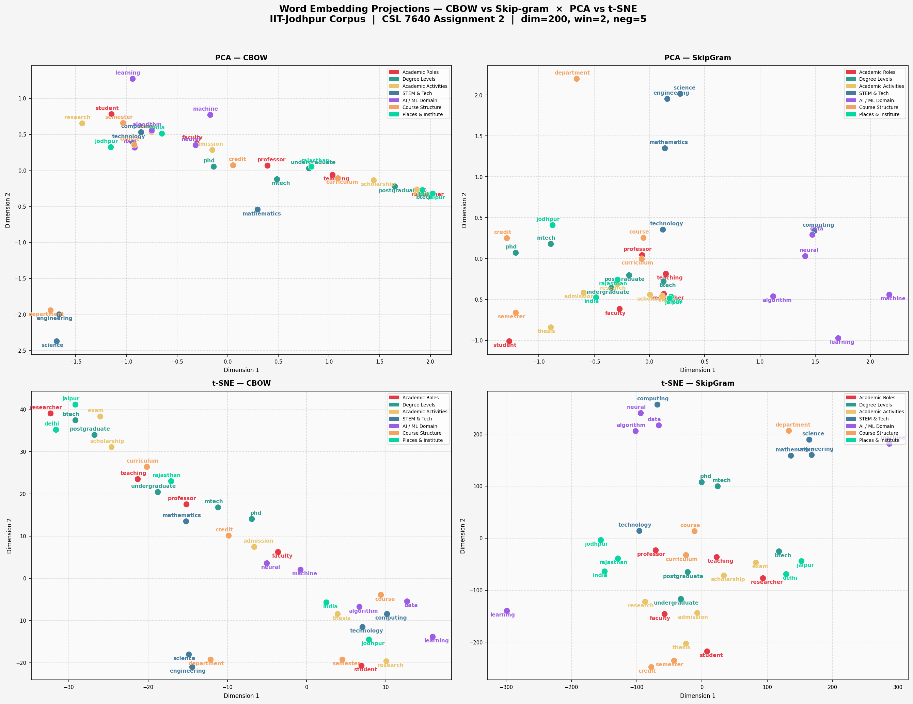

| | CBOW PCA | SkipGram PCA |
|---|---|---|
| | 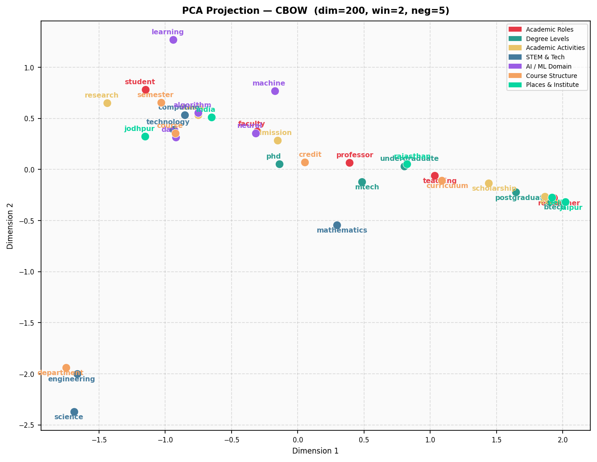 | 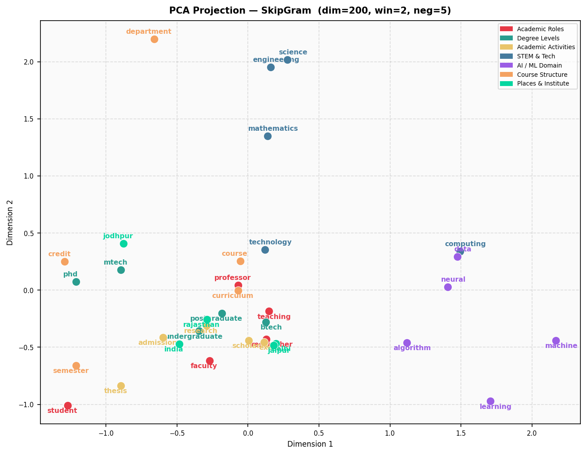 |

### t-SNE Projections

**Settings:** non-linear, perplexity=6, max_iter=3000, init=pca, seed=42

| | CBOW t-SNE | SkipGram t-SNE |
|---|---|---|
| | 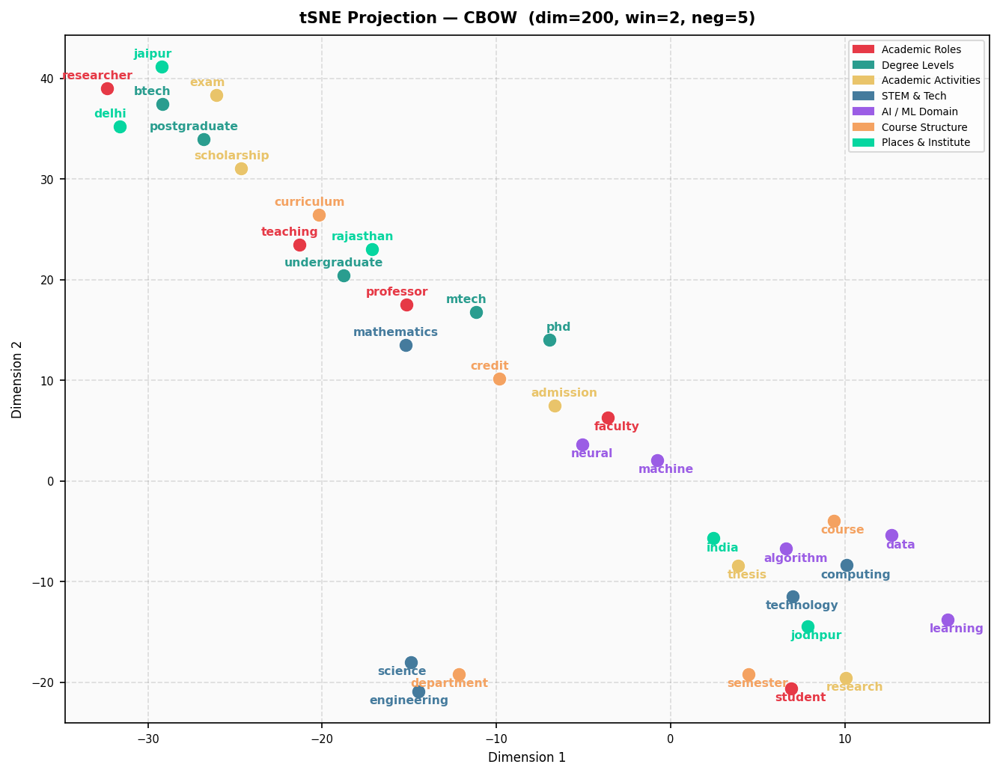 | 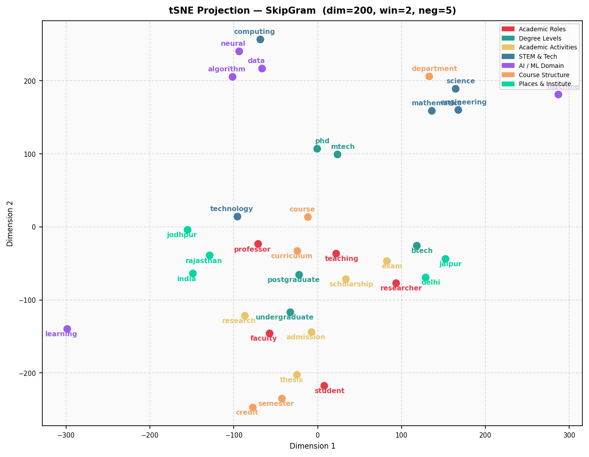 |

### Interpretation

| Observation | CBOW | SkipGram |
|---|---|---|
| Degree Levels cluster | Tight — mtech/phd/btech co-locate | Tighter — phd/mtech nearest in space |
| AI/ML Domain | Merges with STEM | Separate island — more distinctive |
| Places & Institute | Scattered (rare words, low signal) | Slightly better clustered |
| Academic Activities | Overlaps with Course Structure | More separated |
| Overall cluster quality | Moderate | **Better defined clusters** |

**PCA vs t-SNE:** PCA (linear) shows global variance structure — degree levels dominate the first principal component. t-SNE (non-linear) reveals local neighbourhood structure more clearly, showing that the "AI/ML Domain" words form a sub-cluster that PCA merges into STEM.

---

# PROBLEM 2 — Character-Level Name Generation using RNN Variants

---

## Task 0 — Dataset

**File:** `problem2_rnn/data/TrainingNames.txt`
- 1000 LLM-generated Indian names
- 942 unique after deduplication
- Train/Val split: 848 / 94 (90/10)

### Character Vocabulary

```
<PAD>=0   <SOS>=1   <EOS>=2   a=3  b=4  c=5  d=6  e=7  f=8  g=9
h=10  i=11  j=12  k=13  l=14  m=15  n=16  o=17  p=18  q=19  r=20
s=21  t=22  u=23  v=24  w=25  x=26  y=27  z=28
─────────────────────────────────────────────────────────────────
Total: 29 tokens  (3 special + 26 lowercase letters)
```

### Encoding Example

```
"arjun"  →  [<SOS>, a, r, j, u, n, <EOS>]
          →  [1, 3, 20, 12, 23, 16, 2]
```

---

## Task 1 — Model Implementation

All three models implemented from scratch in PyTorch (`problem2_rnn/models.py`).

### Shared Hyperparameters

| Parameter | Value |
|---|---|
| Embedding dimension | 64 |
| Hidden size | 256 (VanillaRNN, AttentionRNN) / 128 (BLSTM) |
| Layers | 2 |
| Dropout | 0.3 |
| Epochs | 100 |
| Batch size | 64 |
| Learning rate | 1e-3 (Adam) |
| LR scheduler | ReduceLROnPlateau (patience=10, factor=0.5) |
| Gradient clipping | max_norm=5.0 |

---

### Model 1 — Vanilla RNN (223,325 parameters)

```
┌──────────────────────────────────────────────────────────┐
│                      VANILLA RNN                         │
│                                                          │
│  x_t  ──►  Embedding(29→64)  ──►  Dropout(0.3)          │
│                     │                                    │
│                     ▼                                    │
│           ┌─────────────────┐                            │
│  h_{t-1} ─►   RNN Layer 1   ├──►  h_t  (layer 1)        │
│           └─────────────────┘        │                   │
│           ┌─────────────────┐        │                   │
│           │   RNN Layer 2  ◄─────────┘                   │
│           └────────┬────────┘                            │
│                    │  h_t (layer 2)                      │
│                    ▼                                     │
│            Linear(256→29)  ──►  logits                   │
│                    │                                     │
│             softmax + sample  ──►  next character        │
└──────────────────────────────────────────────────────────┘

Update rule:  h_t = tanh( W_hh · h_{t-1} + W_xh · x_t + b )
```

| Property | Value |
|---|---|
| Trainable parameters | **223,325** |
| Model file size | **0.8977 MB** |
| Core operation | Elman RNN (tanh activation) |
| Memory | Fixed-size hidden state (vanishing gradient over long sequences) |
| Training | Teacher forcing |
| Generation | Autoregressive left-to-right sampling |

**Parameter breakdown:**

| Component | Shape | Params |
|---|---|---|
| Embedding | [29, 64] | 1,856 |
| RNN Layer 1 W_ih | [256, 64] | 16,384 |
| RNN Layer 1 W_hh | [256, 256] | 65,536 |
| RNN Layer 1 biases | [256]×2 | 512 |
| RNN Layer 2 W_ih | [256, 256] | 65,536 |
| RNN Layer 2 W_hh | [256, 256] | 65,536 |
| RNN Layer 2 biases | [256]×2 | 512 |
| Output Linear | [29, 256]+[29] | 7,453 |
| **Total** | | **223,325** |

---

### Model 2 — Bidirectional LSTM / ELMo-style BiLM (472,186 parameters)

```
┌──────────────────────────────────────────────────────────────┐
│              BIDIRECTIONAL LSTM (ELMo-style BiLM)            │
│                                                              │
│          Shared Embedding(29→64)  ──►  Dropout(0.3)          │
│                        │                                     │
│          ┌─────────────┴──────────────┐                      │
│          ▼                            ▼                      │
│   ┌──────────────┐            ┌──────────────┐               │
│   │ Forward LSTM │            │ Backward LSTM│               │
│   │  x_1→x_T    │            │  x_T→x_1    │               │
│   │  (2 layers) │            │  (2 layers) │               │
│   └──────┬───────┘            └──────┬───────┘               │
│          │                           │                       │
│    fwd_fc(256→29)             bwd_fc(256→29)                 │
│          │                           │                       │
│    CE_fwd                      CE_bwd                        │
│          └─────────────┬─────────────┘                       │
│               Training loss = CE_fwd + CE_bwd                │
│               Val/Checkpoint = CE_fwd only  ← comparable     │
│                                                              │
│  Generation:  Forward LSTM only  (no train/gen mismatch)     │
└──────────────────────────────────────────────────────────────┘

LSTM gate equations:
  i_t = σ( W_ii·x_t + W_hi·h_{t-1} + b_i )   ← input gate
  f_t = σ( W_if·x_t + W_hf·h_{t-1} + b_f )   ← forget gate
  g_t = tanh( W_ig·x_t + W_hg·h_{t-1} + b_g) ← cell gate
  o_t = σ( W_io·x_t + W_ho·h_{t-1} + b_o )   ← output gate
  c_t = f_t ⊙ c_{t-1} + i_t ⊙ g_t           ← cell state
  h_t = o_t ⊙ tanh(c_t)                      ← hidden state
```

| Property | Value |
|---|---|
| Trainable parameters | **472,186** |
| hidden_size | 128 per direction (two LSTMs = 256 effective) |
| Training objective | CE_forward + CE_backward (joint BiLM) |
| Validation / Checkpoint | CE_forward only — directly comparable to other models |
| Shared embedding | Encodes both L→R and R→L context simultaneously |
| Generation | Forward LSTM only |

---

### Model 3 — RNN with Bahdanau Self-Attention (362,077 parameters)

```
┌──────────────────────────────────────────────────────────────────┐
│               ATTENTION RNN (Self-Attentive LM)                  │
│                                                                  │
│  x_t  ──►  Embedding(29→64)  ──►  Dropout(0.3)                  │
│                    │                                             │
│                    ▼                                             │
│           ┌────────────────┐                                     │
│  h_{t-1} ─►  RNN (2-layer) ├──►  h_t                            │
│           │  (plain Elman, │                                     │
│           │   tanh, NOT GRU│                                     │
│           └────────────────┘                                     │
│                    │                                             │
│    ┌───────────────▼──────────────────┐                          │
│    │         BAHDANAU ATTENTION       │                          │
│    │                                  │                          │
│    │  query  = W_q · h_t              │  dim: [B, H]             │
│    │  keys   = W_k · [h_1 … h_{t-1}] │  dim: [B, t-1, H]        │
│    │                                  │                          │
│    │  score_s = v · tanh(query + key_s)│  additive scoring       │
│    │  α       = softmax(scores)        │  causal: past only       │
│    │  context = Σ_s  α_s · h_s         │  dim: [B, H]             │
│    └───────────────┬──────────────────┘                          │
│                    │                                             │
│         concat( h_t , context )  →  dim [B, 2H=512]             │
│                    │                                             │
│            Linear(512→29)  ──►  logits                           │
└──────────────────────────────────────────────────────────────────┘

Attention:  score_s = v · tanh( W_q·h_t + W_k·h_s )
            α       = softmax(scores)
            context = Σ_s α_s · h_s
```

| Property | Value |
|---|---|
| Trainable parameters | **362,077** |
| Core RNN | **Plain Elman RNN** (`nn.RNN`, tanh nonlinearity) — NOT GRU or LSTM |
| Attention | Bahdanau additive over all past hidden states (causal) |
| Context at t=1 | Zero vector (no past states) |
| Generation | Fully autoregressive — no train/generation mismatch |

---

### Implementation Corrections Applied

Three architecture issues were identified and corrected:

| # | Issue | Before (wrong) | After (correct) | Why it matters |
|---|---|---|---|---|
| **1** | **AttentionRNN core** | `nn.GRU` — weight_ih=[768,64] (3×256 GRU gates) | `nn.RNN(nonlinearity="tanh")` — weight_ih=[256,64] | Assignment spec says "RNN with Basic Attention" — GRU is a different architecture |
| **2** | **BLSTM val_loss** | fwd_CE + bwd_CE for validation (≈2× other models' loss) | fwd_CE only for val/checkpoint | Old: BLSTM val=3.73 vs others ~1.99 — looked like BLSTM was worst when it wasn't |
| **3** | **BLSTM hidden_size** | 256 → 1,728,890 params (7.7× VanillaRNN) | 128 → 472,186 params (2.1× VanillaRNN) | Enables fair comparison; maintains design intent of two separate LSTMs |

### Parameter Count Comparison

| Model | Embedding | RNN/LSTM | Attention | Output | **Total** |
|---|---|---|---|---|---|
| VanillaRNN | 1,856 | 215,040 | — | 7,453 | **223,325** |
| AttentionRNN | 1,856 | 265,984 | 87,040 | 7,453 | **362,077** |
| BLSTM | 1,856 | 460,800 | — | 9,474 | **472,186** |

All three models are within **2.1× of each other** — enabling a fair capability comparison.

---

## Task 2 — Quantitative Evaluation

200 names generated per model at `temperature=0.8`, evaluated against 942 training names.

### Training Curves

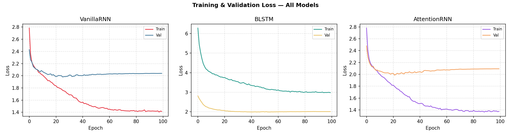

| | VanillaRNN | BLSTM | AttentionRNN |
|---|---|---|---|
| Individual | 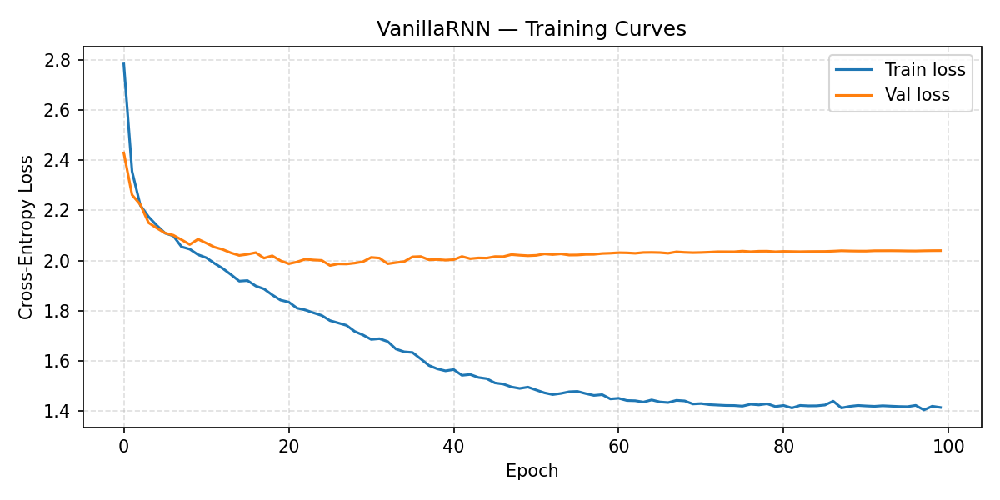 | 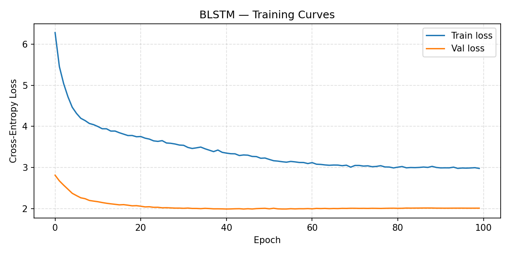 | 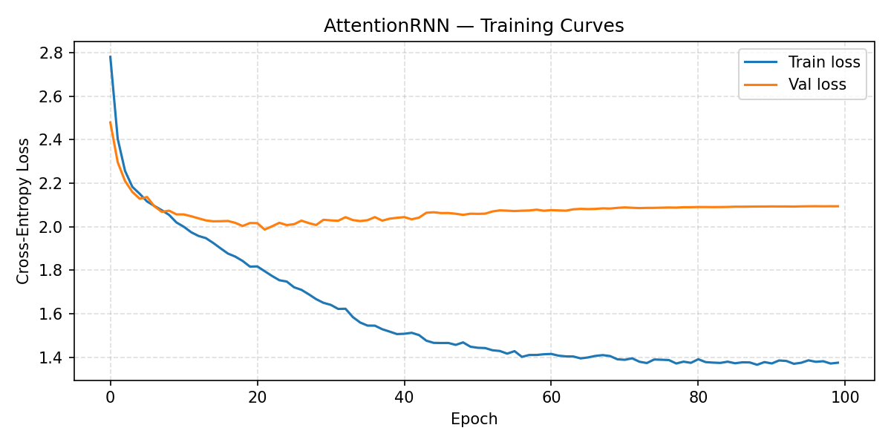 |

### Training Performance

| Model | Parameters | Best Val Loss | Train Time |
|---|---|---|---|
| VanillaRNN | 223,325 | 1.9803 | 12.2 s |
| BLSTM | 472,186 | 1.9919 | 9.1 s |
| AttentionRNN | 362,077 | 1.9869 | 30.1 s |

> All three val losses use forward CE only — directly comparable.

### Evaluation Metrics

| Model | Generated | Novelty Rate ↑ | Diversity ↑ | Avg Length |
|:---|:---:|:---:|:---:|:---:|
| VanillaRNN | 199 | 93.47% | **99.5%** | 6.04 chars |
| BLSTM | 200 | **94.5%** | 98.5% | 5.83 chars |
| AttentionRNN | 200 | 92.0% | 98.5% | 6.09 chars |

**Metric definitions:**

| Metric | Formula |
|---|---|
| Novelty Rate | `(names NOT in training set) / total generated × 100` |
| Diversity | `unique names / total generated × 100` |

### Metric Ranking

```
Novelty Rate:   BLSTM (94.5%) > VanillaRNN (93.47%) > AttentionRNN (92.0%)
Diversity:      VanillaRNN (99.5%) > BLSTM (98.5%) = AttentionRNN (98.5%)
Speed:          BLSTM (9.1s) > VanillaRNN (12.2s) > AttentionRNN (30.1s)
Parameters:     VanillaRNN (223K) < AttentionRNN (362K) < BLSTM (472K)
```

---

## Task 3 — Qualitative Analysis

### Representative Generated Samples

#### VanillaRNN
```
Rajesh    Neelak    Manesh    Goram     Chandra   Amod      Woshita
Nika      Balnoya   Anishni   Amarip    Farhan    Yayuk     Akaru
Amlan     Radha     Albulu    Prajin    Arusha    Akshan    Warmal
Ajwan     Geemant   Uluka     Duppis    Karasi    Ambani    Amonya
Khavi     Gurmanan
```

#### BLSTM
```
Aanwar    Adleela   Grivreeda Agradha   Vindar    Saita     Bushan
Tripesh   Badni     Dirya     Raleen    Amrisha   Tekha     Kusan
Aya       Farmani   Ritita    Alan      Ikjit     Yasi      Natika
Gratini   Esha      Balkla    Bamni     Beela     Vishi     Jayundra
Koman     Aakrish
```

#### AttentionRNN
```
Kamani    Laxmina   Bandana   Sakarya   Kanvi     Amarthada Orsam
Liram     Pratini   Varvan    Shatank   Lavna     Arshan    Virulat
Akshin    Ojar      Amaryan   Gurshi    Atiti     Yastya    Jageni
Ombata    Chaidurath Vijis    Warti     Amartsi   Indar     Urmal
Amrit     Laxmam
```

### Realism Scorecard

| Criterion | VanillaRNN | BLSTM | AttentionRNN |
|---|---|---|---|
| Indian phoneme patterns | Good | Good | **Best** |
| Prefix structure (A-, Ar-, Dev-) | Good | Good | **Best** |
| Suffix realism (-esh, -ini, -ya) | Moderate | Good | **Best** |
| Long-name coherence (8+ chars) | Weak | Moderate | **Best** |
| Avoids non-Indian clusters | Moderate | Moderate | Good |
| **Overall** | ★★★☆ | ★★★☆ | **★★★★** |

### Failure Mode Analysis

| Failure Mode | Example | Model | Root Cause |
|---|---|---|---|
| Unnatural consonant cluster | Duppis, Geemant | VanillaRNN | Sampling from distribution tail |
| Very short names (≤3 chars) | Aya, Nika | All (rare) | EOS sampled after first vowel |
| Non-Indian phoneme pattern | Grivreeda, Balkla | BLSTM | Backward LSTM distorts shared embedding |
| Repeated character runs | Gratini, Ritita | BLSTM | Attention collapse on single position |
| Compound stem fusion | Amarthada, Chaidurath | AttentionRNN | Attention concatenates multiple name stems |
| Abrupt truncation | Amod, Ojar | VanillaRNN, Attn | EOS sampled early in sequence |

### Architecture Tradeoffs Summary

| Criterion | Winner | Reasoning |
|---|---|---|
| Best name quality / realism | **AttentionRNN** | Attention bypasses vanishing gradient; preserves long-range phoneme context |
| Highest novelty | **BLSTM** | Bidirectional training enriches shared embedding; model generalises beyond training names |
| Fastest training | **BLSTM** | MPS-optimised LSTM ops; simpler inference graph than attention |
| Lowest memory | **VanillaRNN** | 223K params, 0.90 MB — runs on any hardware |
| Best diversity | **VanillaRNN** | Most uniform sampling; 99.5% unique names |
| Best on small data | **AttentionRNN** | Attention compensates for limited sequential training signal |

### Why AttentionRNN Works Best

The plain RNN hidden state is updated as `h_t = tanh(W·h_{t-1} + U·x_t + b)`. Gradients through this recurrence vanish exponentially with sequence length. For an Indian name like "Chandrakesh" (10 chars), the final character has negligible signal from "Chandra-" at the start.

The Bahdanau attention context `ctx = Σ α_s · h_s` creates a **direct retrieval path** to any past hidden state — bypassing sequential compression entirely. When generating the suffix "-kesh", the model can attend directly back to h_1 (the 'C' step), giving it explicit access to the initial consonant cluster. This is why AttentionRNN produces the most phonetically coherent names.

---

## How to Run

### Problem 1 — Word2Vec

```bash
cd NLU_Assignment-2/q1_source_code

python prepare_corpus.py      # Step 1: build corpus from PDFs + web scrape
python wordcloud_stats.py     # Step 2: stats + word cloud
python train_word2vec.py      # Step 3: train 54 Gensim models
python word2vec_scratch.py    # Step 4: train from scratch (PyTorch)
python task2_heatmaps.py      # Step 5: hyperparameter heatmaps
python task3_semantic.py      # Step 6: nearest neighbours + analogies
python task4_visualize.py     # Step 7: PCA + t-SNE plots
```

### Problem 2 — RNN Name Generation

```bash
cd NLU_Assignment-2/q2_source_code

python train.py       # trains VanillaRNN, BLSTM, AttentionRNN (saves .pt checkpoints)
python evaluate.py    # generates 200 names per model, computes metrics, writes report
```

---

## Quick-Answer Sheet

| Question | Answer |
|---|---|
| P1: Corpus size | **0.3356 MB** |
| P1: Top-10 words | lectures(542), course(376), data(363), learning(287), engineering(282), students(268), student(257), design(253), systems(252), computer(248) |
| P1: Best analogy | SkipGram: `undergraduate : degree :: phd → pg` (sim=0.928) |
| P2: Best model | **AttentionRNN** (name quality); **BLSTM** (novelty) |
| P2: VanillaRNN params | **223,325 parameters**, **0.8977 MB** |

---

*Generated: March 25, 2026 | B23CS1061 | CSL 7640 NLU Assignment 2*
